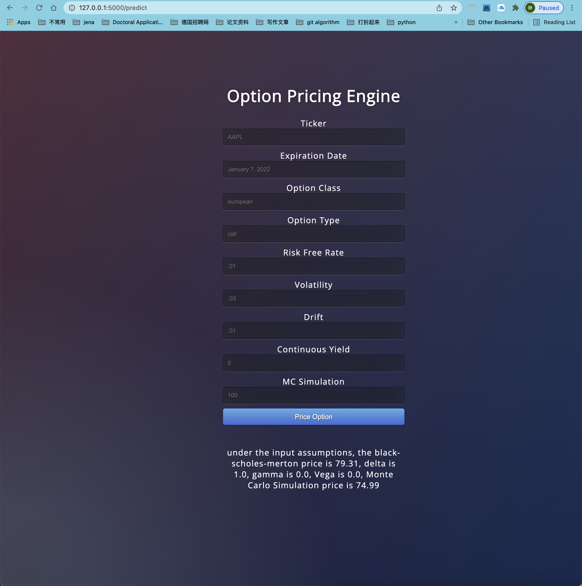
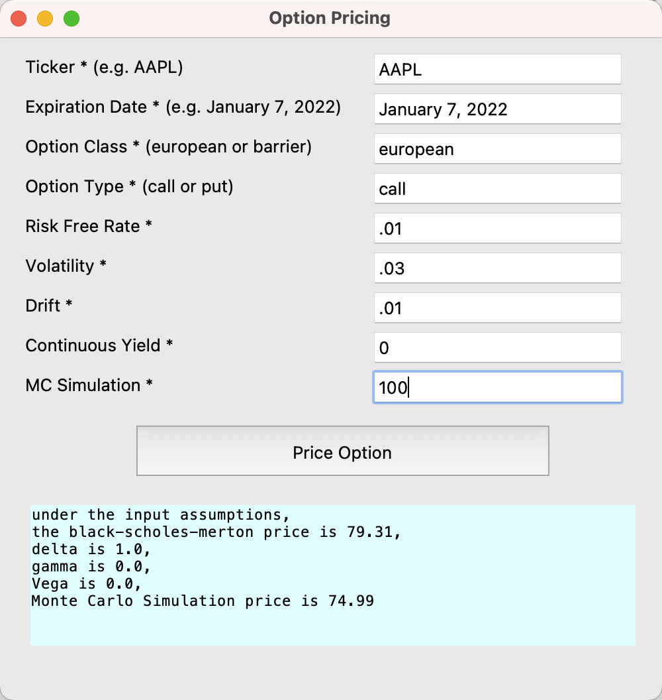
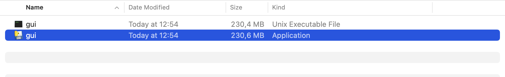
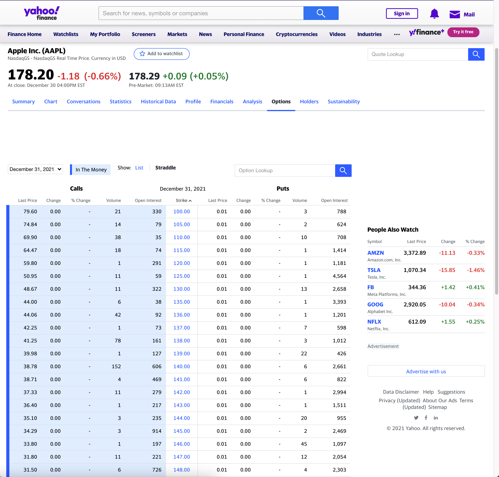

# Monte Carlo Option Pricing Engine

<!-- TABLE OF CONTENTS -->
<details>
  <summary>Table of Contents</summary>
  <ol>
    <li> <a href="#ABOUT THE PROJECT">About This Project</a>
    <li> <a href="#Set up environment">Set up environment</a>
    </li>
    <li>
      <a href="#usage">Usage</a>
      <ul>
        <li><a href="#Logic">Logic</a></li>
        <li><a href="#Assumptions">Assumptions</a></li>
        <li><a href="#Limitations">Limitations</a></li>
        <li><a href="#Future Improvements">Future Improvements</a></li>
      </ul>
    </li>
    <li><a href="#Backend algorithm logic">Backend algorithm logic !!!</a></li>
      <ul>
        <li><a href="#Shortcomings and future improvements">Shortcomings and Future Improvements</a></li>
      </ul>
    <li><a href="#Guide on adding more options">Guide on adding more options</a></li>
    <li><a href="#contact">Contact</a></li>
  </ol>
</details>

<!-- ABOUT THE PROJECT -->
## About this project

This project is used for pricing options through **Monte Carlo Simulation**. Current 
supported option types are **European option** and **Barrier option**. 

Two applications are provided: web app and exe app. Currently, both user interface only accepts
European option. 

The following are web app GUI and exe app GUI respectively.






<p align="right">(<a href="#top">back to top</a>)</p>

<!-- Set up environment -->
## Set up environment
There is no need to set up environment for Exe App. 

To set up environment for Web App, you can run
the following code in your terminal.
```commandline
# create environment
conda create -n ope python=3.9
conda activate ope
# install necessary packages (dependencies)
pip install flask yfinance yahoo_fin
# run app.py
python app.py
# open http://127.0.0.1:5000/ in your browser
```
Note: the web app is not responsive, please report bug if something abnormal happened.

<p align="right">(<a href="#top">back to top</a>)</p>

<!-- usage -->
## Usage

To run exe app, you can simply double-click
the exe file under directory ```output```


Then the GUI will pop up.


To use Web App, in the terminal, run:
```commandline
python app.py
```
and open http://127.0.0.1:5000/ in your browser, you will see:


<!-- Logic -->
### Logic

**The option you want to price can be found here: https://finance.yahoo.com/.** Input ticker AAPL is
the same as input ticker AAPL in the search bar of this website. Under the option tag, you can see
call (in/out of money) and put (in/out of money) European Options with features such as contract
name, last trade date, strike and so on. The default setting is to price the first option (the 
option with the smallest contract name)

The following graph shows the screenshot of the current Apple Inc.'s options.



<!-- Assumptions -->
### Assumptions:

* The underlying follows a statistical process called geometric Brownian motion, which implies 
that the continuously compounded return is normally distributed.
* Geometric Brownian motion implies continuous prices, meaning that the price of underlying 
instrument does not jump from one value to another; rather, it moves smoothly from value to value.
* The underlying instrument is liquid, meaning that it can be easily bought and sold.
* Continuous trading is available, meaning that in the strictest sense one must be able to trade 
at every instant.
* There are no market frictions, such as transaction costs, regulatory constraints, or taxes.
* No arbitrage opportunities are available in the marketplace.
* The continuously compounded risk-free interest rate is known and constant; borrowing and lending
is allowed at the risk-free rate.
* The volatility of the return on the underlying is known and constant.
* If the underlying instrument pays a yield, it is expressed as a continuous known and constant 
yield at an annualized rate.
*Intraday underlying values are not considered, but only the close value


<!-- Limitations -->
### Limitations:

- Both portal only support European option pricing (Barrier Option is **not** supported)
- No data integrity check, meaning wrong type or wrong format can easily break the application
- only one option under call/put tag is valued.

<!-- Future Improvements -->
### Future Improvements:

- Add data integrity checking, e.g. only integer is allowed for Monte Carlo Simulation steps. 
- Use selection box for some inputs, e.g. Option Type can only be chosen as either call or put.
- Add Barrier Option pricing function
- Allow more kinds of options, such as Bermuda, Asian, Rainbow
- Value more options once, e.g. all in-the-money call options.
- better looking GUI
- Make Web APP GUI responsive.


<p align="right">(<a href="#top">back to top</a>)</p>

<!-- Backend algorithm logic -->
## Backend Algorithm Logic (IMPORTANT!!!!)

<!-- Shortcomings and future improvements -->
### Shortcomings and Future Improvements:

- **Assume the Greeks for Barrier Options and European Options are the same. Therefor no further
unittest with regard to the Greeks of Barrier Options**
- **The unittest is not necessarily right.** For the lack of confidence, I used my own output as the
standard to pass all the unittest. I tried the standard library ```option-price```, the results are
different, but I think mine is right. I also want to try library ```QuantLib``` and ```p4f``` to
get a second opinion. But due to the unfortunate fact that my M1 Mac has no access to those via
pip. As a result, after 4 hours of trying to install via wheel, I failed and gave up.
- **Add unittest logic**: the premium of European option should be larger than that of Barrier Option
- **Add unittest logic**: check greeks for both European and Barrier option

<!-- Guide on adding more options -->
## Guide on adding more options 

I have left interfaces to add more options in the file ```financial_instruments.py``` and 
```MCPricer.py```. Just locate the example code, change the class name and the corresponding 
transaction regulations. 

The interface in the file ```financial_instruments.py```:
```commandline
class rainbowOption(baseOption):
    def __init__(self):
        super(baseOption, self).__init__()
    # def get_vega(self):
    #     pass
    # def get_gamma(self):
    #     pass
    # def get_delta(self):
    #     pass
```

The interface in the file ```MCPricer.py```:
```commandline
    elif self.option_class == "rainbow":
        pass
```

<!-- Contact -->
## Contact

Any ideas you wanna share with me, send me an email: jingzhang6057@gmail.com :D

<p align="right">(<a href="#top">back to top</a>)</p>